<p align="center">
  
</p>

<p align="center">
  <a href="https://github.com/chandanB47">
    
  </a>
  <a href="https://linkedin.com/in/chandan47">
    
  </a>
</p>

---

## ABOUT

I'm a **Data Analytics professional in development**, focused on turning structured data into useful business insights.

My current core stack is **SQL, Excel and Power BI**, supported by Python for automation and analytical workflows. I build projects that combine data cleaning, querying, KPI analysis, visualization and business-focused problem solving.

> **Analyze the data. Understand the business. Communicate the insight.**

---

## WHAT I BUILD

|  | Focus | What I work on |
|---|---|---|
| 🗄️ | **SQL Analytics** | Joins, aggregations, subqueries, data cleaning, business questions |
| 📊 | **Excel Analytics** | Data cleaning, lookups, PivotTables, reporting and KPI analysis |
| 📈 | **Power BI** | Power Query, data preparation, modeling, DAX and interactive dashboards |
| 🐍 | **Python** | OOP, automation, problem solving and practical applications |

---

## FEATURED PROJECTS

### 🛒 Retail Store Operations & Analytics
**SQL · Data Cleaning · Joins · Aggregation · Business Analysis**

A relational retail analytics project covering stores, employees, products, customers, orders and order items. Includes data-cleaning tasks, organizational analysis and business questions designed around real operational scenarios.

### 🚗 Vehicle Management System
**Python · OOP · Classes · Functions · Menu-Driven Application**

A practical Python application built to strengthen object-oriented programming, program structure, input handling and application logic.

### 🎓 Student Management System
**Python · Application Logic · CRUD Concepts**

A menu-driven project focused on structured programming, record management and clean application flow.

### 🎟️ Event Ticket Reservation System
**Python · Functions · Validation · Application Workflow**

A practical reservation workflow designed to strengthen Python fundamentals and real-world problem solving.

### 📊 Excel Analytics Work
**Excel · Data Cleaning · VLOOKUP · PivotTables · Visualization**

Hands-on analytical exercises focused on transforming raw data into structured reports and useful business views.

> More Power BI and analytics projects are being added as I progress.

---

## TECH STACK

<p align="center">
  
</p>

<p align="center">
  
  
  
  
</p>

**Core:** Python · SQL · MySQL · Excel · Power BI · Power Query · Git · GitHub

**Analytics:** Data Cleaning · Data Transformation · KPI Analysis · Exploratory Analysis · Reporting · Data Visualization

---

## CURRENT FOCUS


My immediate priority is becoming stronger at **end-to-end analytics**:

**SQL → Excel → Power BI → Statistics → Machine Learning**

The long-term direction is **Data Science → AI → Generative AI**.

---

## HOW I WORK

```text
Raw Data
   ↓
Clean & Validate
   ↓
Query & Transform
   ↓
Analyze
   ↓
Visualize
   ↓
Business Insight
   ↓
Improve
```

I prefer learning by **building**, documenting the work, reviewing the result, and then increasing the difficulty.

---

## CONNECT

<p align="center">
  <a href="https://github.com/chandanB47">GitHub</a>
  &nbsp; • &nbsp;
  <a href="https://linkedin.com/in/chandan47">LinkedIn</a>
</p>

<p align="center">
  <sub>Building practical skills. Solving real problems. Improving one project at a time.</sub>
</p>
