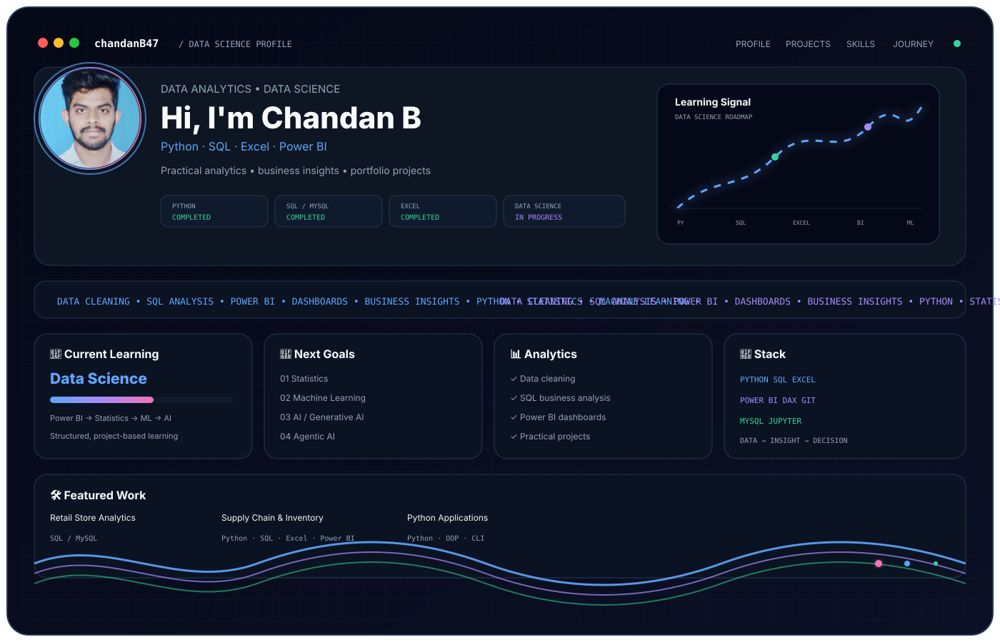

# 👋 Hi, I'm Chandan B

<picture>
  <source media="(prefers-color-scheme: dark)" srcset="./dark.svg">
  <source media="(prefers-color-scheme: light)" srcset="./light.svg">
  
</picture>

  <b>🚀 Building my journey from Data Analytics to Data Science & AI</b>

  
  

---

## 🧑‍💻 About Me

I'm a **Data Science learner** building practical skills through structured learning, problem-solving, and hands-on projects.

**Learn → Practice → Build → Document → Improve**

---

## 📚 Learning Progress

| Technology / Subject | Status |
|---|---|
| 🐍 Python | ✅ Completed |
| 🗄️ SQL / MySQL | ✅ Completed |
| 📊 Excel | ✅ Completed |
| 📈 Power BI | 🔄 Currently Learning |
| 📉 Statistics | ⏳ Upcoming |
| 🤖 Machine Learning | ⏳ Upcoming |
| 🧠 Artificial Intelligence | ⏳ Upcoming |
| ✨ Generative AI | ⏳ Upcoming |
| 🧩 Agentic AI | ⏳ Upcoming |

---

## 🚀 Projects

| Project | Technology |
|---|---|
| 🛒 Retail Store Operations & Analytics | SQL / MySQL |
| 📦 Supply Chain & Inventory Health Optimizer | Python · SQL · Excel · Power BI |
| 🐍 Python Applications | Python · OOP · CLI |

---

## 🔗 Connect

- [GitHub](https://github.com/chandanB47)
- [LinkedIn](https://linkedin.com/in/chandan47)

